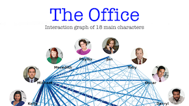

Hi there!👋 I'm Nhu Duong, a master student in Data Science at Macquarie University, Sydney, Australia 🇦🇺. I'm interested in 📈Time-Series Forecasting, NLP and 🖼 Data Visualization. 

---
## Portfolio Projects
### [Applied Data Science to The Office TV Show](/portfolio/Applied_DS_TheOffice/)

Exploring The Office (U.S) transcript data with `pandas`, `nltk`, `NetworkX`

Over 29,000 views on Reddit [/r/dataisbeautiful](https://www.reddit.com/r/dataisbeautiful/comments/lulc9h/interaction_graph_of_18_characters_in_the_office/)

