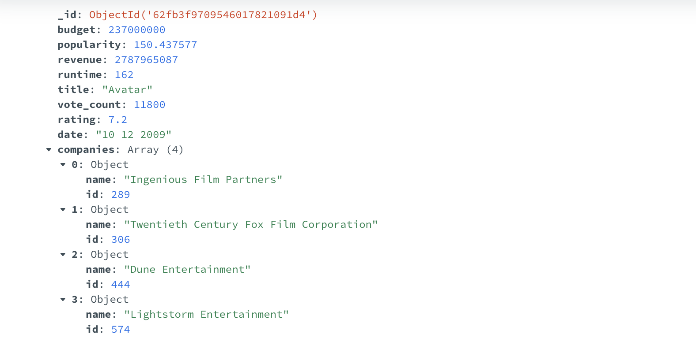

Implementing Merge Sort and Bucket Sort using `MapReduce` model  in `MongoDB` database.

## Introduction 
Big Data requires a different approach to distributed data storage that is designed for large-scale clusters. MapReduce is an important component when it comes to processing files in Big Data. It is a programming model for processing large data sets with a parallel, distributed algorithm on a cluster. It designed to process large data sets in parallel by dividing the work into a set of independent tasks. 
There are 2 main functions of `MapReduce`, `_map_` function processes a key/value pair to generate a set of intermediate key/value pairs and `_reduce_` function merges all intermediate values associated with the same intermediate key. [^1]. 

## Overview
In this post, I am going to implementing Merge Sort and Bucket Sort using `MapReduce` model  in `MongoDB` database. The main tasks are:
1. Calculate the number of movies released by each production company for each year in the dataset
2. Implement the Merge Sort algorithm and the Bucket Sort algorithm using two MapReduce programs, to sort results of Task 1.

#### Dataset:
Movies data set.

[^1]: MapReduce(https://www.usenix.org/legacy/events/osdi04/tech/full_papers/dean/dean_html/)

## Task 1: Calculate the number of movies released by each production company for each year in the dataset.

1. **Data Retrieval**: Access the '`movie` -> `date`' path to obtain the release date. Extract release year.
2. **Company Identification**: Access the '`movie` -> `companies`' path to identify the production companies associated with the movie. Note that a movie may be jointly produced by multiple companies, we only consider  the top three production companies.
3. **Data Formatting**: Generate a series of pairs for each movie in the following format: `<year, company>`. This can be achieved by combining the movie's release year (Step 1) with the names of the production companies (Step 2).
4. **Data Storage**: Store `<year, company>` pairs of all movies into a text file. This text file will serve as the input data for the subsequent MapReduce program.
5. **MapReduce Implementation**:  using `mrjob` to calculate the frequency of each `<year, company>` pair. 